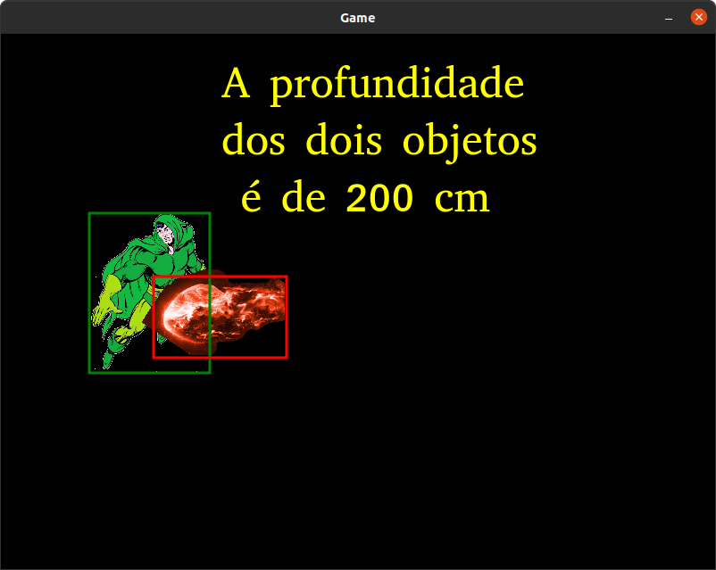
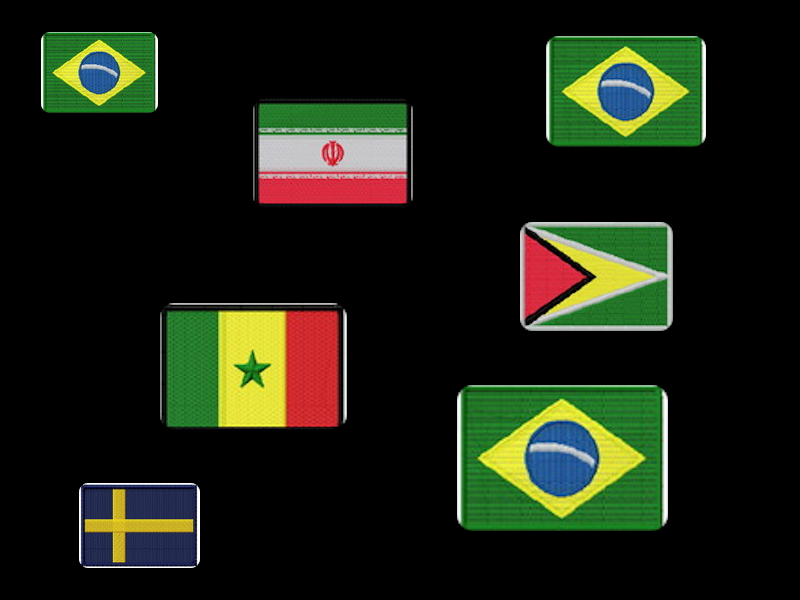

# Robótica Computacional 2022.1

## Avaliação Intermediária (P1)

**Indique seu nome e as questões que escolheu fazer logo abaixo. Você deve escolher 4 questões, senão o avaliador o fará por você.**

Nome:_______________

Questões que fez:____________

**Observações de avaliações nesta disciplina:**

* Clone o repositório da prova dentro de `~/catkin_ws/src` se estiver trabalhando no Linux.
* Você poderá dar quantos `git push` quiser no repositório, apenas o último será considerado.
* Antes de finalizar a prova verifique que os arquivos enviados ao github estão na sua última versão. É sua responsabilidade garantir isso.
* Inicie a prova no Blackboard para a ferramenta de Proctoring iniciar.
* Só finalize a prova no Blackboard após enviar a prova via Github classroom.
* Durante esta prova vamos registrar somente a tela, não a câmera nem microfone
* Ponha o nome no enunciado da prova no Github
* Tenha os repositórios https://github.com/Insper/robot22.1/ ,  https://github.com/arnaldojr/my_simulation e https://github.com/arnaldojr/mybot_description.git  atualizados em seu `catkin_ws/src`.
* Você pode consultar a internet ou qualquer material, mas não pode se comunicar com pessoas ou colegas a respeito da prova
* Todos os códigos fornecidos adicionalmente aos scripts em que as questões serão desenvolvidas foram testados em outro contexto, e são apenas um compilado. Não é obrigatório usar. Fique à vontade para modificar esse código e trazer outros arquivos que achar melhor. 
* Teste sempre seu código
* Entregue código que executa - código com erro que impede de executar implica em zero na questào
* Faça commits e pushes frequentes no seu repositório (tem dicas [no final deste arquivo](./instrucoes_setup.md))
* Permite-se consultar qualquer material online ou próprio. Não se pode compartilhar informações com colegas durante a prova.
* Faça commits frequentes. Em caso de disputa sobre plágio, o primeiro a enviar alguma ideia será considerado autor original.
* A responsabilidade por ter o *setup* funcionando é de cada estudante.
* Questões de esclarecimento geral podem ser perguntadas no chat do Teams.
* É proibido colaborar ou pedir ajuda a colegas ou qualquer pessoa que conheça os assuntos avaliados nesta prova.
* Os exercícios admitem diversas estratégias de resolução. A prova de cada aluno é única. Atenha-se apenas à rubrica de cada questão.

Existe algumas dicas de referência rápida de setup [instrucoes_setup.md](instrucoes_setup.md)

**Integridade Intelectual**

Se você tiver alguma evidência de fraude cometida nesta prova, [use este serviço de e-mail anônimo](https://www.guerrillamail.com/pt/compose)  para informar ao professor através do e-mail `antoniohps1@insper.edu.br`.

# Questões

## Questão 1  (2.50 pontos)

Nesta questão você irá determinar se o personagem do jogo "Deep Space Warriors" foi atingido por um meteoro. Como o jogo possui 3 dimensões, você deverá checar se os retângulos envolventes (*bounding boxes*) do personagem e do meteoro se interceptam, e se a diferença entre as profundidades deles é menor do que 40 cm. Por profundidade de um objeto entende-se a distância do mesmo até a câmera virtual que gera a imagem do jogo.

As imagens `green_lama.png` e `meteoro.png` correspondem às imagens vistas do personagem e do meteoro se ambos estiverem a uma profundidade de 60 cm. A altura do personagem (comprimento na vertical) é de 180 cm, e do meteoro é de 111.3 cm.

### O que você deverá fazer

Você deverá editar a função `meteoro_acertou()` que irá determinar se o meteoro acertou ou não o personagem. Você não deve se preocupar com as situações em que o personagem encobre totalmente o meteoro ou vice-e-versa, preocupe-se apenas quando ambos os objetos são visíveis

A saída esperada é a imagem com as bounding boxes, o texto `ACERTOU`escrito na imagem no caso do meteoro ter acertado o personagem, e as profundidades (distâncias) dos objetos escritas no terminal.

*Exemplo de situação onde o meteoro acertou o personagem*
Não precisa escrever os dizeres na imagem, apenas `ACERTOU`

*Exemplo de situação onde o meteoro não acertou o personagem*
Não precisa escrever os dizeres na imagem

#### Orientações

Trabalhe no arquivo `./q1/q1.py`. Este exercício **não precisa** de ROS. Portanto pode ser feito até em Mac ou Windows

#### O que você deve fazer:

|Resultado| Conceito| 
|---|---|
| Não executa | zero |
| Determina a distância focal da câmera virtual | 0.6|
| Segmenta o personagem e o meteoro (separadamente), mostrando evidências | 1.3|
| Identifica as profundidades dos objetos e escreve no terminal | 2.1 |
| Identifica corretamente a colisão entre os objetos | 2.5 |

Casos intermediários ou omissos da rubrica serão decididos pelo professor.

## Questão 2  (2.50 pontos)

Você deverá desenvolver o código para identificar e desenhar as arestas e os vértices de um quadrado, usando cores diferentes para cada aresta e cada vértice. Quando o quadrado tiver arestas na vertical, não é necessário fazer a identificação.

#### Orientações

Trabalhe no arquivo `q2/q2.py`. Este exercício **não precisa** de ROS. Portanto pode ser feito até em Mac ou Windows

#### O que você deve fazer:

|Resultado| Conceito| 
|---|---|
| Não executa | zero |
| Segmenta as linhas e mostra saída visual | 1.0|
| Identifica as retas das arestas do quadrado e apresenta saída visual das mesmas| 1.5|
| Distingue cada uma retas, usando cores diferentes para desenhá-las | 2.0|
| Apresenta os vértices do quadrado | 2.5 |

Casos intermediários ou omissos da rubrica serão decididos pelo professor.

## Questão 3  (2.50 pontos)

Nesta questão você deverá fazer um retângulo em volta de todas as bandeiras do Brasil.
Não poderá ser usada a informação da posição das mesmas, apenas as cores.

Observe que há bandeiras com cores semelhantes, porém apenas a do Brasil possui figuras com cores distintas uma dentro da outra.

#### Orientações

Trabalhe no arquivo `q3/q3.py`. Este exercício **não precisa** de ROS. Portanto pode ser feito até em Mac ou Windows

#### O que você deve fazer:

|Resultado| Conceito| 
|---|---|
| Não executa | zero |
| Segmenta a cor verde e gera saída visual |0.6|
| Identifica pelo menos uma bandeira do Brasil | 1.0|
| Identifica todas as bandeira do Brasil e até duas outras | 1.5|
| Identifica todas as bandeira do Brasil e apenas uma outra | 2.0|
| Identifica todas e apenas as bandeiras do Brasil| 2.5 |

Casos intermediários ou omissos da rubrica serão decididos pelo professor.

## Questões de ROS

**Atenção: ** 

Para fazer estra questão você precisa ter o `my_simulation` e o `mybot_description` atualizado.

    cd ~/catkin_ws/src
    cd my_simulation
    git stash
    git pull

Ou então se ainda não tiver:

    cd ~/catkin_ws/src
    git clone https://github.com/arnaldojr/my_simulation.git

Para o mybot_description:

    cd ~/catkin_ws/src
    cd mybot_description
    git stash
    git pull

Ou então se ainda não tiver:

    cd ~/catkin_ws/src
    git clone https://github.com/arnaldojr/mybot_description

Em seguida faça o [catkin_make](./instrucoes_setup.md). 

## Questão 4 (2.50 pontos)

</img>

Seu robô está no cenário visível abaixo:

    roslaunch my_simulation pista_oval.launch

#### O que é para fazer

Faça o robô dar uma volta na pista abaixo, parando quando chegar próximo ao início (você pode descobrir isso usando a odometria). A distância do robô à posição inicial deve ser impressa no terminal. Dicas: 

1. Você pode centralizar o robô na pista tanto usando o ponto de fuga quanto o ponto de cruzamento da  reta central com a linha inferior da imagem.

1. Caso você esteja usando o ponto de fuga, e aparecer apenas a reta da esquerda, gire o robô para a direita, e vice-versa.

1. Caso o robô saia da pista, é permitido retorná-lo ao centro da pista no mesmo ponto em que ele saiu. Porém o robô deve demonstrar habilidade em seguir o ponto de fuga ou o ponto de base da reta central (robô fugindo da pista deve ser um caso de exceção)

1. Caso a pista apareça muito curva na imagem e não possa ser bem aproximada por uma reta, você pode usar apenas a porção inferior da mesma para encontrar retas melhores  

Para responder à questão você deverá trabalhar em `p1_221/scripts/q4.py`:

1. Preencher a função `gerar_ponto_referencia()` que deve retornar o ponto central da imagem, o ponto de referência para o controle do robô e a imagem com o ponto de referência desenhado usando um croshair

2. Usando as informações geradas pela função acima, preencha o loop de controle do robô para mantê-lo centralizado na pista

3. Preencher a função `distancia_origem()` para calcular e imprimir a distância do robô à origem

#### Detalhes de como rodar

O código para este exercício está em: `p1_221/scripts/q4.py`

Para rodar, recomendamos que faça:

    roslaunch my_simulation quarto.launch

Depois:

    rosrun p1_221 q4.py

|Resultado| Conceito| 
|---|---|
| Não executa | 0 |
| Segmenta a reta do centro ou as retas das laterais e fornece evidência visual | 0.7 |
| Encontra ao menos uma das retas e fornece evidência visual  | 1.2 |
| Encontra o ponto de referência para controle do robô | 1.8 |
| O robô consegue dar ao menos uma volta na pista | 2.2|
| O robô para após completar uma volta | 2.5|

Casos intermediários ou omissos da rubrica serão decididos pelo professor.

## Questão 5 (2.50 pontos)

Seu robô está no cenário visível abaixo:

    roslaunch my_simulation encaixotado.launch

#### O que é para fazer

Gire o robô até encontrar o bloco com a figura assinalada (veja a tabela abaixo). Ao centralizar a figura, use o lidar para chegar próximo (30 cm) daquela figura. Depois, gire 180 graus e pare a 30 cm do bloco que está diametralmente oposto.

Quem cujo primeiro nome se inicia com as letras da tabela abaixo, deve inicialmente se aproximar da figura correspondente:

|Letra inicial do nome| Figura inicial| 
|---|---|
| A até C | Cachorro |
| D até H | Cavalo |
| I até P | Pássaro |
| Q até Z | XXX |

#### Detalhes de como rodar

O código para este exercício está em: `212_p1/scripts/q5.py`

Para rodar, recomendamos que faça:

    roslaunch my_simulation cubos.launch

Depois:

    rosrun p1_212 q5.py

|Resultado| Conceito| 
|---|---|
| Não executa | 0 |
| Faz o robô detectar a primeira figura apenas, e mostra evidências | 1.0 |
| Consegue centralizar na primeira figura | 1.50|
| Chega próximo à primeira figura | 2.00|
| Dá a volta e chega na segunda figura | 2.50|

Casos intermediários ou omissos da rubrica serão decididos pelo professor.

**Boa sorte!!**